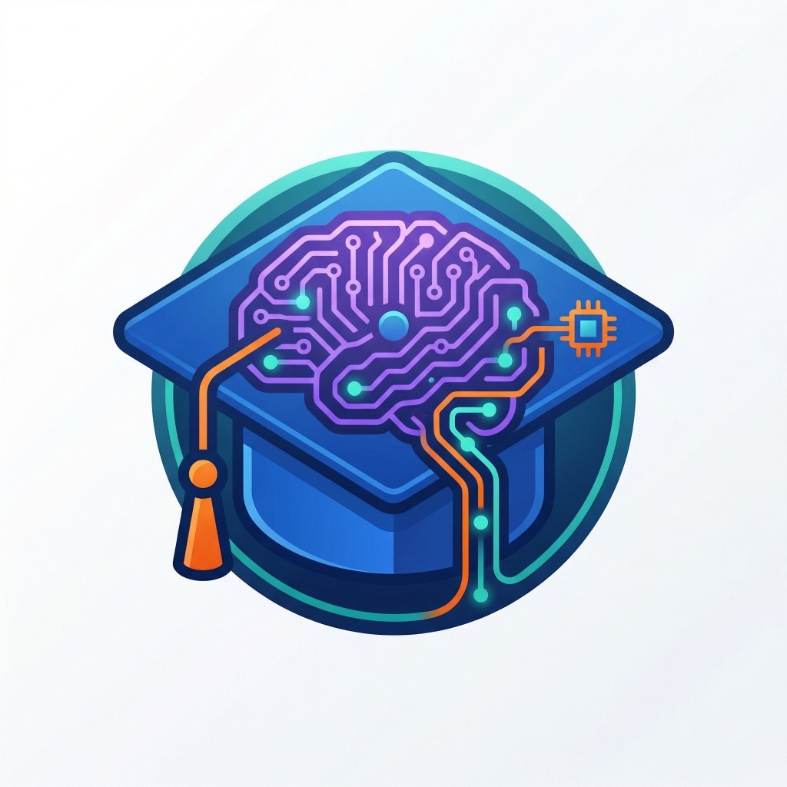

<div align="center">
  
  
  # AI & LLM Lectures
  
  A comprehensive, modern lecture platform built with Next.js for learning about Artificial Intelligence, Large Language Models, Prompting, AI Tooling, and their real-world applications.
  
  **Made by [gurkanfikretgunak](https://github.com/gurkanfikretgunak)**
</div>

## ✨ Features

- 📚 **Comprehensive Content**: Lectures covering Prompting, LLM, AI Tooling, Reasoning, Applications, and Resources
- 🤖 **AI Assistant Panel**: **Powerful in-browser AI assistant** available on all pages - get instant help with coding, development, and general questions. Runs entirely locally using WebLLM (no API keys needed)
- 🎓 **Learn to Prompt**: Interactive prompt engineering simulator with dedicated AI assistant running entirely in your browser
- 🌍 **Bilingual Support**: Full English and Turkish language support with automatic fallback
- 🎨 **Modern UI**: Beautiful, responsive design with dark mode support, RGB wave animations, and fireflies effects
- 🔍 **Powerful Search**: Fast, client-side search across all lectures
- 📊 **Interactive Diagrams**: Mermaid diagram support with zoom, pan, and touch controls
- 💻 **Multi-Language Code**: Code examples in Python, TypeScript, C#, and Dart
- 📱 **Mobile Responsive**: Optimized for all screen sizes
- ⚡ **Fast Performance**: Built with Next.js 14 for optimal performance
- 🎯 **Table of Contents**: Automatic TOC generation from headings
- 🏆 **Completion Certificates**: Generate and download certificates (PNG/PDF) after completing simulations
- 🔒 **Password Protection**: Optional password gate for content protection
- 📝 **Commit History**: View project commit history directly from footer with GitHub-styled modal
- 🎨 **Animated CTAs**: Interactive "Learn to Prompt" card with RGB wave animations and sparkles fireflies effects

## 🚀 Getting Started

### Prerequisites

- Node.js 18+ 
- npm, yarn, pnpm, or bun

### Installation

1. Clone the repository:
```bash
git clone https://github.com/gurkanfikretgunak/lectures-nextjs.git
cd lectures-nextjs
```

2. Install dependencies:
```bash
npm install
# or
yarn install
# or
pnpm install
```

3. (Optional) Configure password protection:
```bash
cp config.yaml.example config.yaml
# Edit config.yaml to set your password
```

4. Run the development server:
```bash
npm run dev
# or
yarn dev
# or
pnpm dev
```

5. Open [http://localhost:3000](http://localhost:3000) in your browser.

## 🤖 AI Assistant & Helping Panel

The platform features **two powerful AI assistants** that run entirely in your browser using WebLLM technology. No API keys, no external services - everything runs locally for privacy and speed.

### 🏠 Homepage AI Assistant (General Purpose)

Access a **general-purpose AI assistant** directly from the homepage header. Perfect for everyday coding questions, software development help, and general knowledge.

**Key Features:**
- 🚀 **Instant Access**: Click the AI Assistant button in the top-right header (next to search)
- 💬 **Chat Interface**: Clean, modern chat UI with message history
- 🧠 **Model Selection**: Choose between **SmolLM2** (faster, smaller) or **Llama-3.2-1B** (more capable)
- 💾 **Smart Caching**: Models download once and cache in IndexedDB - instant loading on return visits
- 🔄 **Model Switching**: Switch between models anytime with confirmation dialog
- 🗑️ **Reset Chat**: Clear conversation history with one click
- 📊 **Download Progress**: Real-time progress tracking during model download
- ⚡ **WebGPU Powered**: Leverages WebGPU for fast, local inference
- 🔒 **Privacy First**: All processing happens in your browser - no data sent to servers

**What It Can Help With:**
- Programming and coding questions (JavaScript, TypeScript, Python, React, etc.)
- Software development problems and debugging
- General knowledge and explanations
- Daily life questions and advice
- Learning new concepts
- Problem-solving

**How to Use:**
1. Click the **AI Assistant** button in the header (top-right, near search)
2. On first use, select your preferred model (SmolLM2 or Llama-3.2)
3. Start chatting! Ask any coding or development question
4. Use the settings icon to switch models or reset chat anytime

### 🎓 Learn to Prompt AI Assistant

A specialized AI assistant integrated into the **Learn to Prompt** simulation page, designed to help you master prompt engineering.

**Key Features:**
- 📍 **Context-Aware**: Knows which step you're on and provides relevant guidance
- 💡 **Step Suggestions**: Quick suggestion chips for common questions per step
- 🎯 **Focused Help**: Tailored responses for prompt engineering challenges
- 🔄 **Same Technology**: Uses the same WebLLM engine as the homepage assistant
- 📚 **Built-in Fallback**: Helpful tips available even without WebGPU support

**How to Use:**
1. Navigate to `/learn-to-prompt`
2. The AI assistant appears on the right side (or bottom on mobile)
3. Ask questions about the current step or prompt engineering in general
4. Use suggestion chips for quick common questions

### 🔧 Technical Details

**Supported Models:**
- **SmolLM2-360M**: Fast, lightweight model (~360MB) - great for quick responses
- **Llama-3.2-1B**: More capable model (~1.5GB) - better for complex questions

**Browser Requirements:**
- **Recommended**: Chrome/Edge with WebGPU support for full AI capabilities
- **Fallback**: Any modern browser - built-in helper mode works everywhere

**Model Caching:**
- Models are cached in IndexedDB after first download
- Subsequent visits load instantly (no re-download needed)
- Cache persists across browser sessions
- Clear cache by clearing browser data if needed

**Privacy & Security:**
- ✅ All AI processing happens locally in your browser
- ✅ No API keys or external services required
- ✅ No data sent to external servers
- ✅ Complete privacy and data control

## 🎓 Learn to Prompt Feature

The platform includes an interactive **"Learn to Prompt"** simulation that teaches prompt engineering through hands-on practice.

### Features

- **6-Step Guided Simulation**: Learn to build effective prompts step-by-step (Goal → Role → Context → I/O → Examples → Refine)
- **🤖 Dedicated AI Assistant**: Get real-time, context-aware help from an AI assistant powered by WebLLM (runs entirely in your browser, no API keys needed)
  - Knows which step you're on and provides relevant guidance
  - Quick suggestion chips for instant common questions
  - Same powerful WebLLM technology as the homepage assistant
- **Built-in Helper Mode**: Works even without WebGPU - includes helpful tips and examples for each step
- **Step-by-Step Guidance**: Each step includes:
  - Clear explanations of why it matters
  - Checklist of what to include
  - Example snippets ready to use
  - Real-time scoring feedback
- **Quick Suggestions**: Tap suggestion chips to ask common questions instantly
- **Completion Certificate**: Generate downloadable certificates (PNG/PDF) after completing all steps
- **Model Caching**: AI model downloads once and caches in IndexedDB for instant loading on return visits

### How to Use

1. Navigate to `/learn-to-prompt` from the home page
2. Start with Step 1: Define the Goal
3. Use the AI assistant on the right (or built-in helper) for guidance
4. Complete all 6 steps to generate your certificate
5. Download your certificate as PNG (for sharing) or PDF (for printing)

### Browser Requirements

- **For AI Assistant**: Chrome/Edge with WebGPU support (recommended)
- **For Built-in Helper**: Any modern browser (works everywhere)

The simulation teaches you to build production-ready prompts through a practical "Auth Sign-In Component" example, but the techniques apply to any prompt engineering task.

### Certificate Generation

Upon completing all 6 steps, you can generate a completion certificate:

- **Name Input**: Personalize your certificate with your name
- **Score Breakdown**: See your performance for each step
- **Overall Rating**: Get a star rating (1-5 stars) based on your prompt quality
- **Export Options**:
  - **PNG**: High-quality image perfect for sharing on LinkedIn, Twitter, etc.
  - **PDF**: Print-ready document for formal use
- **Details Included**: Name, simulation title, completion date, steps completed, and overall score

## 📁 Project Structure

```
lectures-nextjs/
├── app/                      # Next.js app directory
│   ├── [category]/          # Dynamic category routes
│   │   └── [slug]/          # Dynamic lecture routes
│   ├── learn-to-prompt/     # Learn to Prompt feature
│   │   ├── page.tsx         # Route handler
│   │   └── learn-to-prompt-page.tsx  # Main page component
│   ├── layout.tsx           # Root layout
│   ├── page.tsx             # Home page
│   ├── home-page.tsx        # Home page component
│   └── not-found.tsx        # 404 page
├── components/              # React components
│   ├── layout/              # Layout components (header, sidebar, TOC, footer)
│   │   ├── header.tsx       # Site header with navigation
│   │   ├── footer.tsx       # Footer with commit history
│   │   ├── commit-history-modal.tsx # GitHub-styled commit history modal
│   │   ├── sidebar.tsx      # Desktop sidebar navigation
│   │   ├── mobile-sidebar.tsx # Mobile sidebar navigation
│   │   └── toc.tsx          # Table of contents
│   ├── general-assistant.tsx # 🤖 Homepage AI Assistant (general purpose)
│   ├── global-assistant-wrapper.tsx # Global AI assistant wrapper
│   ├── learn-to-prompt/     # Learn to Prompt components
│   │   ├── prompt-simulator.tsx      # Step-by-step simulator
│   │   ├── assistant-chat.tsx        # 🤖 AI assistant chat UI (Learn to Prompt)
│   │   ├── completion-certificate.tsx # Certificate generator
│   │   ├── webllm-engine.ts          # 🤖 WebLLM integration (shared engine)
│   │   └── simulation-data.ts        # Simulation step definitions
│   ├── mdx/                 # MDX custom components
│   │   ├── mermaid.tsx      # Mermaid diagram component (with zoom/pan)
│   │   ├── multi-language-code.tsx  # Multi-language code blocks
│   │   └── code-block.tsx   # Code block component
│   └── ui/                  # UI components (shadcn/ui)
├── content/                 # MDX lecture files
│   ├── prompting/          # Prompting lectures
│   ├── llm/                # LLM lectures
│   ├── ai-tooling/         # AI Tooling lectures
│   ├── reasoning/          # Reasoning lectures
│   ├── applications/       # Application case studies
│   └── resources/          # Resources
├── contexts/               # React contexts
│   └── language-context.tsx # Language switching context
├── lib/                    # Utility libraries
│   ├── mdx.ts              # MDX file processing
│   ├── mdx-components.tsx  # MDX component mappings
│   ├── translations.ts     # Translation strings
│   └── config.ts           # Configuration loader
└── config.yaml             # Configuration file
```

## 📝 Content Management

### Creating a New Lecture

1. Create a new MDX file in the appropriate category directory:
```bash
content/prompting/301.mdx
```

2. Add frontmatter:
```yaml
---
title: "Your Lecture Title"
description: "Brief description of the lecture"
category: "prompting"
level: 301
order: 3
---
```

3. Write your content using Markdown and MDX:
```markdown
# Your Lecture Title

Your content here...

<Mermaid chart={`
flowchart LR
    A[Start] --> B[End]
`} />

<MultiLanguageCode
  python={`print("Hello, World!")`}
  typescript={`console.log("Hello, World!");`}
/>
```

### File Naming Convention

- **English (default)**: `{slug}.mdx` (e.g., `101.mdx`)
- **Turkish**: `{slug}.tr.mdx` (e.g., `101.tr.mdx`)

See [CONTENT_TRANSLATION.md](./CONTENT_TRANSLATION.md) for detailed translation guidelines.

### Categories

- `prompting` - Prompting techniques and strategies
- `llm` - Large Language Models
- `ai-tooling` - AI development tools and frameworks
- `reasoning` - Advanced reasoning patterns
- `applications` - Real-world AI applications
- `resources` - Additional learning materials

### Lecture Levels

- `100-199` - Beginner level
- `200-299` - Advanced level

## 🎨 Custom Components

### Mermaid Diagrams

Render interactive flowcharts and diagrams with zoom, pan, and touch controls:

```mdx
<Mermaid chart={`
flowchart TB
    A[Start] --> B[Process]
    B --> C[End]
`} />
```

**Interactive Features:**
- **Auto-fit**: Automatically scales diagrams that overflow their container
- **Desktop Controls**: Mouse wheel zoom, trackpad pinch, click-and-drag panning
- **Mobile Controls**: Two-finger pinch-to-zoom, two-finger drag panning
- **Fullscreen Mode**: View diagrams in fullscreen with all interactive controls

### Multi-Language Code Blocks

Display code examples in multiple languages:

```mdx
<MultiLanguageCode
  python={`# Python code`}
  typescript={`// TypeScript code`}
  csharp={`// C# code`}
  dart={`// Dart code`}
/>
```

## 🌍 Multi-Language Support

The platform supports English and Turkish. Language preference is stored in cookies and localStorage.

### Adding Translations

1. Create a Turkish version of your MDX file:
```bash
content/prompting/101.tr.mdx
```

2. Translate the content while keeping:
   - Same frontmatter structure
   - Same code examples
   - Same file structure

3. The system automatically:
   - Shows Turkish content when Turkish is selected
   - Falls back to English if Turkish version doesn't exist
   - Updates navigation and UI based on language preference

## 🛠️ Tech Stack

- **Framework**: [Next.js 14](https://nextjs.org/) (App Router)
- **Language**: TypeScript
- **Styling**: [Tailwind CSS](https://tailwindcss.com/)
- **UI Components**: [shadcn/ui](https://ui.shadcn.com/)
- **Content**: MDX with [next-mdx-remote](https://github.com/hashicorp/next-mdx-remote)
- **Diagrams**: [Mermaid](https://mermaid.js.org/) with interactive zoom/pan
- **Code Highlighting**: [rehype-pretty-code](https://github.com/atomiks/rehype-pretty-code)
- **Search**: [FlexSearch](https://github.com/nextapps-de/flexsearch)
- **Icons**: [Lucide React](https://lucide.dev/)
- **🤖 AI Assistant Engine**: [WebLLM](https://github.com/mlc-ai/web-llm) - **Powerful in-browser AI inference**
  - Models: Llama-3.2-1B-Instruct & SmolLM2-360M-Instruct
  - Runs entirely in browser (no API keys, no external services)
  - WebGPU-accelerated for fast local inference
  - IndexedDB caching for instant model loading
- **Certificate Generation**: [html2canvas](https://html2canvas.hertzen.com/) + [jsPDF](https://github.com/parallax/jsPDF)

## 📦 Available Scripts

- `npm run dev` - Start development server
- `npm run build` - Build for production
- `npm run start` - Start production server
- `npm run lint` - Run ESLint

## 🚀 Deployment

### Vercel (Recommended)

1. Push your code to GitHub
2. Import your repository on [Vercel](https://vercel.com)
3. Vercel will automatically detect Next.js and deploy

### Other Platforms

The app can be deployed to any platform that supports Next.js:
- Netlify
- AWS Amplify
- Railway
- Self-hosted with Node.js

## 🔧 Configuration

### Password Protection

Edit `config.yaml` to enable password protection:

```yaml
password:
  enabled: true
  value: "your-password-here"
  message: "Enter password to access the lectures"
```

### Customization

- **Theme**: Modify `tailwind.config.ts` for custom colors
- **Fonts**: Update fonts in `app/layout.tsx`
- **Translations**: Edit `lib/translations.ts` for UI translations

## 🤝 Contributing

Contributions are welcome! Please feel free to submit a Pull Request.

1. Fork the repository
2. Create your feature branch (`git checkout -b feature/AmazingFeature`)
3. Commit your changes (`git commit -m 'Add some AmazingFeature'`)
4. Push to the branch (`git push origin feature/AmazingFeature`)
5. Open a Pull Request

### Content Contributions

- Follow the existing MDX structure
- Include frontmatter with proper metadata
- Add code examples where applicable
- Consider adding Turkish translations

## 📄 License

This project is private and proprietary.

## 🙏 Acknowledgments

- Built with [Next.js](https://nextjs.org/)
- UI components from [shadcn/ui](https://ui.shadcn.com/)
- Icons from [Lucide](https://lucide.dev/)
- Code highlighting by [Shiki](https://shiki.matsu.io/)
- **🤖 AI Assistant powered by [WebLLM](https://github.com/mlc-ai/web-llm) from MLC AI** - Enabling privacy-first, in-browser AI inference
- Diagram rendering by [Mermaid](https://mermaid.js.org/)

## 🎨 UI Features

### Animated Components

- **RGB Wave CTA**: The "Learn to Prompt" card features an animated RGB wave effect on hover
- **Sparkles Fireflies**: Interactive fireflies animation around the Sparkles icon in the CTA card
- **Smooth Transitions**: All UI elements feature smooth transitions and hover effects

### Footer

- **Commit History**: Click on the commit hash in the footer to view project commit history
- **GitHub Integration**: Direct links to GitHub repository and commit history
- **Text-Only Design**: Clean, minimal footer design without icons

## 📞 Support

For issues, questions, or contributions, please open an issue on GitHub.

---

<div align="center">
  Made with ❤️ by <a href="https://github.com/gurkanfikretgunak">gurkanfikretgunak</a> for the AI learning community
  
  <p>
    <a href="https://masterfabric.co">masterfabric.co</a> • 
    <a href="https://github.com/gurkanfikretgunak/lectures-nextjs">GitHub</a>
  </p>
</div>
